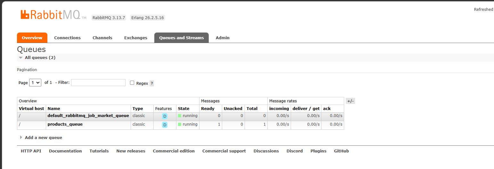
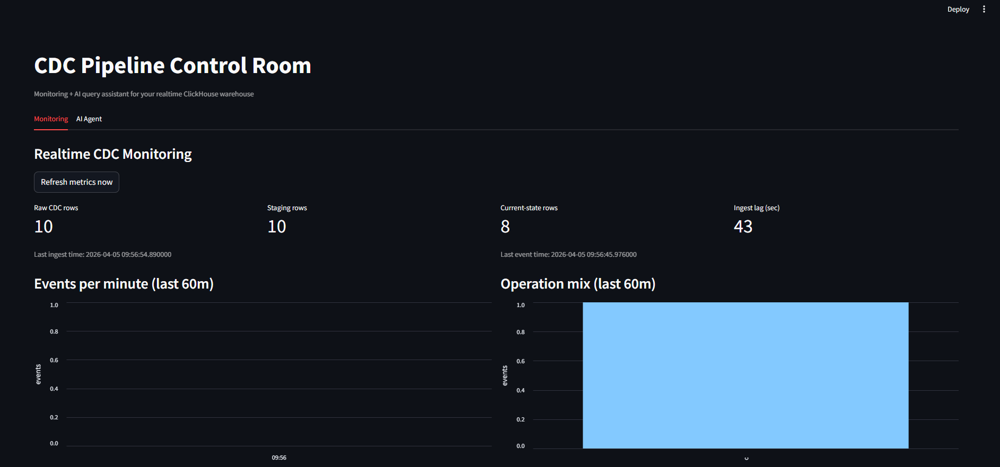
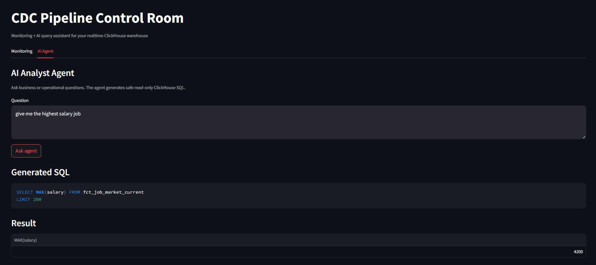

# CDC-Pipeline

Simple real-time CDC pipeline:
PostgreSQL -> Debezium -> RabbitMQ -> ClickHouse -> dbt -> Streamlit AI dashboard.

Dataset source: [Kaggle - AI and Data Science Job Market Dataset](https://www.kaggle.com/datasets/shree0910/ai-and-data-science-job-market-dataset-20202026)

## Architecture


## Components

### RabbitMQ (Message Broker)


### Streamlit Dashboard + AI Agent


### Ollama (Local LLM) Text2SQL


## How To Run (Quick Start)

### 1) Start all services

```bash
cd CDC-Pipeline
docker compose up -d --build
```

### 2) Check containers

```bash
docker compose ps
```

Expected containers:
- `my_postgres_container`
- `my_rabbitmq_container`
- `my_debezium_server`
- `my_clickhouse_container`
- `my_dbt_container`
- `my_streamlit_agent`
- `my_ollama_container`

### 3) Open the UIs

- Streamlit: http://localhost:8501
- RabbitMQ: http://localhost:15672 (guest / guest)
- ClickHouse Web UI: http://localhost:8083
- dbt Docs UI: http://localhost:8081

## AI Agent Setup (Optional)

Priority: Ollama local -> OpenAI -> Gemini

### Option A: Ollama (recommended)

Use internal Docker URL (default in compose):

```bash
# Make sure Ollama service is running
docker compose up -d ollama

# Pull model inside container
docker exec my_ollama_container ollama pull llama3.2:1b

# Optional override (already default in docker-compose.yaml)
export OLLAMA_MODEL=llama3.2:1b
export OLLAMA_BASE_URL=http://ollama:11434/v1

# Restart streamlit to pick env changes
docker compose up -d --build streamlit
```

### Option B: OpenAI

```bash
export OPENAI_API_KEY=<your_openai_key>
export OPENAI_MODEL=gpt-4.1-mini
docker compose up -d --build streamlit
```

### Option C: Gemini

```bash
export GEMINI_API_KEY=<your_gemini_key>
export GEMINI_MODEL=gemini-2.0-flash
docker compose up -d --build streamlit
```

## Basic Verify Commands

### Check Debezium health

```bash
docker logs my_debezium_server --tail 100
```

### Check landing table in ClickHouse

```bash
bash scripts/init_clickhouse_landing.sh
docker exec my_clickhouse_container clickhouse-client -q "SHOW TABLES FROM default LIKE '%job_market%';"
```

### Check CDC rows arriving

```bash
docker exec my_clickhouse_container clickhouse-client -q "SELECT count() AS rows, max(ingested_at) AS last_ingest FROM default.raw_job_market_cdc;"
```

## Common Commands

### Stop stack

```bash
docker compose down
```

### Clean reset (delete volumes)

```bash
docker compose down -v
```

### Reset Debezium CDC metadata (after recreating DB/table)

```bash
bash scripts/reset_debezium_cdc.sh
```

## Notes

- This setup is for development.
- If AI provider is not configured, monitoring still works; only AI tab fails.
- For deep architecture details, see [ARCHITECTURE.md](ARCHITECTURE.md).
