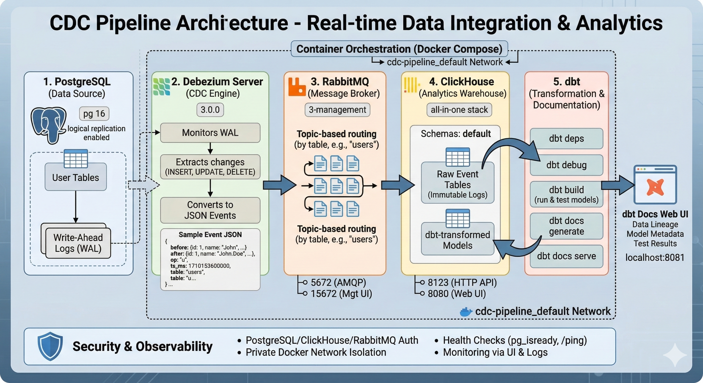

# CDC-Pipeline

A real-time Change Data Capture (CDC) pipeline that captures database changes using Debezium, streams events through RabbitMQ, and stores them in ClickHouse for analytics.

## 📋 Table of Contents

- [Overview](#overview)
- [Architecture](#architecture)
- [Features](#features)
- [Prerequisites](#prerequisites)
- [Installation](#installation)
- [Configuration](#configuration)
- [Usage](#usage)
- [Data Flow](#data-flow)
- [Monitoring](#monitoring)
- [Troubleshooting](#troubleshooting)
- [Contributing](#contributing)
- [License](#license)

## 🔍 Overview

This CDC pipeline uses Debezium to capture real-time database changes, streaming them as JSON events through RabbitMQ. These raw logs are then ingested into a warehouse where dbt transforms the "before/after" snapshots into clean, structured tables. dbt automatically runs on startup to transform and test your models. This ensures low-latency data sync and a decoupled analytical architecture.

### Key Components

- **PostgreSQL**: Source database with logical replication enabled
- **Debezium Server**: CDC engine that monitors database changes
- **RabbitMQ**: Message broker for event streaming
- **ClickHouse**: Analytics warehouse for storing and querying CDC events
- **dbt**: Transform engine that builds and tests data models on ClickHouse with interactive docs UI

## 🏗️ Architecture



For detailed architecture documentation including component descriptions, data flow steps, and design patterns, see [ARCHITECTURE.md](ARCHITECTURE.md).

## ✨ Features

- **Real-time CDC**: Captures INSERT, UPDATE, and DELETE operations
- **Logical Replication**: Uses PostgreSQL's Write-Ahead Log (WAL)
- **Decoupled Architecture**: Message broker enables multiple consumers
- **Automatic Transformations**: dbt runs on startup to build and test models
- **Data Documentation**: Interactive dbt docs UI with lineage and column-level metadata
- **Scalable**: Easy to add more sources or sinks
- **Event Streaming**: JSON-formatted change events
- **Low Latency**: Near real-time data synchronization

## 📦 Prerequisites

- Docker (20.10+)
- Docker Compose (2.0+)
- 4GB+ RAM available for containers
- Basic understanding of CDC concepts

## 🚀 Installation

1. **Clone the repository**

   ```bash
   git clone <repository-url>
   cd CDC-Pipeline
   ```

2. **Start all services**

   ```bash
   docker-compose up -d
   ```

3. **Verify all containers are running**

   ```bash
   docker-compose ps
   ```

   You should see 5 containers running:
   - `my_postgres_container`
   - `my_rabbitmq_container`
   - `my_debezium_server`
   - `my_clickhouse_container`
   - `my_dbt_container` (runs dbt transformations and serves docs UI)

## ⚙️ Configuration

### PostgreSQL Configuration

The PostgreSQL instance is configured with logical replication:

```yaml
command: ["postgres", "-c", "wal_level=logical"]
```

### Debezium Configuration

Edit `debezium_conf/application.properties` to customize:

```properties
# Sink configuration
debezium.sink.type=rabbitmq
debezium.sink.rabbitmq.connection.host=rabbitmq

# Source configuration
debezium.source.connector.class=io.debezium.connector.postgresql.PostgresConnector
debezium.source.database.hostname=postgres_db
debezium.source.database.port=5432
debezium.source.database.user=myuser
debezium.source.database.password=mypassword
debezium.source.database.dbname=mydatabase
debezium.source.topic.prefix=cdc_event
```

### ClickHouse Configuration

Custom user configuration in `clickhouse_users.xml`:

```xml
<!-- Add custom user settings here -->
```

### dbt Configuration

The dbt project is configured in the `dbt/` directory:

- **dbt_project.yml**: Project configuration (name, version, model paths, etc.)
- **profiles.yml**: ClickHouse connection settings
  - Host: `clickhouse` (Docker network)
  - Port: `8123`
  - Schema: `default`
  - User: `api` / Password: `api`

dbt **automatically runs on startup** with the following command sequence:
```bash
dbt deps
dbt debug
dbt build           # runs models and tests
dbt docs generate
dbt docs serve
```

## 📚 Usage

### Access Service UIs

- **dbt Docs & Lineage**: http://localhost:8081
  - Auto-generated documentation of models and tests
  - View model lineage and column descriptions
  - No authentication required

- **RabbitMQ Management**: http://localhost:15672
  - Username: `guest`
  - Password: `guest`

- **ClickHouse Web UI**: http://localhost:8080

- **ClickHouse HTTP Interface**: http://localhost:8123
  - Username: `api`
  - Password: `api`
### Connect to PostgreSQL

```bash
docker exec -it my_postgres_container psql -U myuser -d mydatabase
```

### Monitor RabbitMQ Queues

Check the RabbitMQ management UI to see CDC events being published.

### Query ClickHouse

```bash
docker exec -it my_clickhouse_container clickhouse-client
```

### Run dbt Commands Manually

You can run dbt commands manually (outside of the automatic startup):

```bash
# Run models
docker exec my_dbt_container dbt run

# Run tests
docker exec my_dbt_container dbt test

# Build (run models + tests)
docker exec my_dbt_container dbt build

# Generate and serve docs
docker exec my_dbt_container dbt docs generate
docker exec my_dbt_container dbt docs serve --host 0.0.0.0 --port 8080
```

### Create Test Data

Create a table in PostgreSQL and insert data:

```sql
-- Connect to PostgreSQL
CREATE TABLE users (
    id SERIAL PRIMARY KEY,
    name VARCHAR(100),
    email VARCHAR(100),
    created_at TIMESTAMP DEFAULT NOW()
);

-- Insert test data
INSERT INTO users (name, email) VALUES 
    ('John Doe', 'john@example.com'),
    ('Jane Smith', 'jane@example.com');

-- Update a record
UPDATE users SET email = 'john.doe@example.com' WHERE id = 1;

-- Delete a record
DELETE FROM users WHERE id = 2;
```

These changes will be automatically captured by Debezium and sent to RabbitMQ.

## 🔄 Data Flow

1. **Change Occurs**: Application modifies data in PostgreSQL
2. **WAL Capture**: PostgreSQL writes to Write-Ahead Log
3. **Debezium Reads**: Debezium streams WAL changes
4. **Event Creation**: Changes are converted to JSON events with before/after snapshots
5. **Message Publishing**: Events are published to RabbitMQ
6. **Event Consumption**: Consumers read from RabbitMQ queues
7. **Data Loading**: Events are loaded into ClickHouse
8. **Transformation**: dbt automatically transforms raw events into structured tables
9. **Documentation**: dbt serves interactive docs UI with model lineage and descriptions

### Event Format

```json
{
  "before": { "id": 1, "name": "John", "email": "john@example.com" },
  "after": { "id": 1, "name": "John", "email": "john.doe@example.com" },
  "op": "u",
  "ts_ms": 1678464000000
}
```

## 📊 Monitoring

### Check Debezium Logs

```bash
docker logs -f my_debezium_server
```

### Check Service Health

```bash
# PostgreSQL
docker exec my_postgres_container pg_isready

# RabbitMQ
curl -u guest:guest http://localhost:15672/api/healthchecks/node

# ClickHouse
curl http://localhost:8123/ping
```

### View Container Stats

```bash
docker stats
```

## 🔧 Troubleshooting

### Debezium Not Capturing Changes

1. Verify PostgreSQL WAL level:
   ```sql
   SHOW wal_level;  -- Should return 'logical'
   ```

2. Check Debezium logs for errors:
   ```bash
   docker logs my_debezium_server
   ```

3. Ensure the table has a PRIMARY KEY (required for CDC)

### RabbitMQ Connection Issues

1. Verify RabbitMQ is running:
   ```bash
   docker ps | grep rabbitmq
   ```

2. Check network connectivity:
   ```bash
   docker exec my_debezium_server ping rabbitmq
   ```

### ClickHouse Data Not Loading

1. Check data volume permissions:
   ```bash
   ls -la clickhouse_data/
   ```

2. Verify ClickHouse logs:
   ```bash
   docker logs my_clickhouse_container
   ```

### dbt Container Keeps Restarting

1. Check dbt logs to identify the error:
   ```bash
   docker logs my_dbt_container
   ```

2. Common issues:
   - **git not found**: Rebuild the dbt image with `docker compose up -d --build dbt`
   - **Connection timeout**: Ensure ClickHouse is healthy: `docker ps | grep clickhouse`
   - **Profile errors**: Verify `dbt/profiles.yml` has correct ClickHouse credentials

### Containers Won't Start

```bash
# Remove existing containers and volumes
docker-compose down -v

# Restart services
docker-compose up -d
```

### dbt Models or Tests Failing

1. Check the dbt logs:
   ```bash
   docker logs my_dbt_container
   ```

2. Run dbt debug to verify connection:
   ```bash
   docker exec my_dbt_container dbt debug
   ```

3. Verify your SQL models are syntactically correct for ClickHouse (not all PostgreSQL syntax is supported)

## 🛠️ Development

### Stop All Services

```bash
docker-compose down
```

### Remove All Data (Clean Start)

```bash
docker-compose down -v
rm -rf clickhouse_data/* clickhouse_logs/* mongodb_data/*
```

### View Service Logs

```bash
# All services
docker-compose logs -f

# Specific service
docker-compose logs -f debezium
```

## 🤝 Contributing

Contributions are welcome! Please feel free to submit a Pull Request.

1. Fork the repository
2. Create your feature branch (`git checkout -b feature/AmazingFeature`)
3. Commit your changes (`git commit -m 'Add some AmazingFeature'`)
4. Push to the branch (`git push origin feature/AmazingFeature`)
5. Open a Pull Request

## 📄 License

This project is licensed under the Apache License 2.0 - see the [LICENSE](LICENSE) file for details.

## 📞 Support

If you encounter any issues or have questions:

1. Check the [Troubleshooting](#troubleshooting) section
2. Review Docker container logs
3. Open an issue in the repository

## 🔗 Resources

- [Debezium Documentation](https://debezium.io/documentation/)
- [PostgreSQL Logical Replication](https://www.postgresql.org/docs/current/logical-replication.html)
- [RabbitMQ Tutorials](https://www.rabbitmq.com/getstarted.html)
- [ClickHouse Documentation](https://clickhouse.com/docs)

---

**Note**: This is a development setup. For production use, ensure proper security configurations, authentication, and network isolation.
